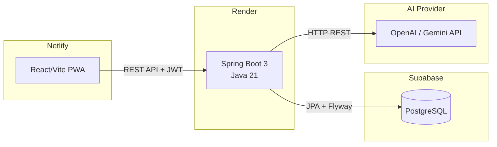
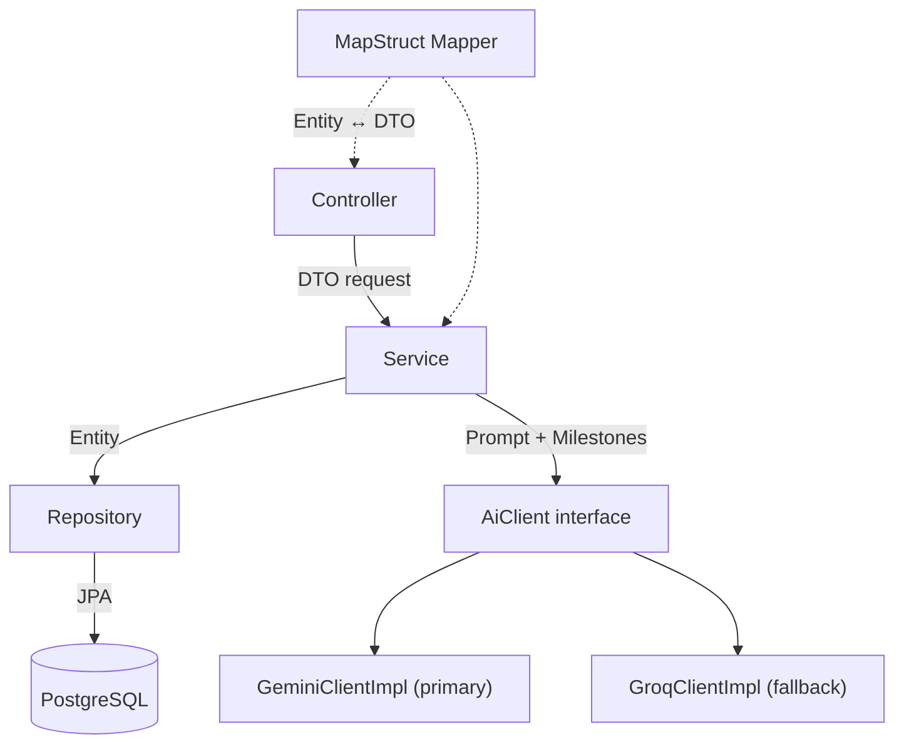
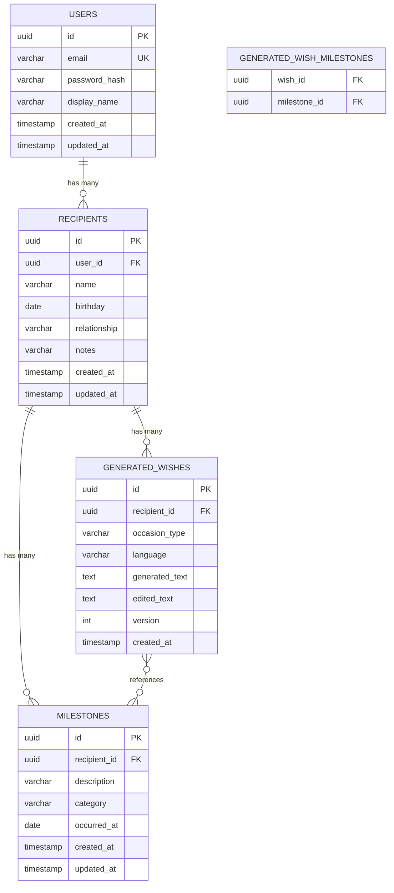

# Time-Capsule Wishes — MVP Implementation Plan

## 1.1 Summary

Xây dựng MVP cho **Time-Capsule Wishes** — một ứng dụng cho phép người dùng ghi lại các milestone (sự kiện quan trọng) của bạn bè/người thân trong năm, rồi dùng AI để tổng hợp thành lời chúc cá nhân hóa vào dịp sinh nhật hoặc sự kiện đặc biệt.

Scope MVP gồm: **Backend** (Spring Boot 3 + Java 21 trên Render), **Database** (PostgreSQL trên Supabase với Flyway migration), **Frontend** (React/Vite PWA trên Netlify), và **AI integration** (gọi OpenAI/Gemini API để sinh lời chúc). Reminder flow **không** nằm trong MVP — wish generation hoàn toàn on-demand. Hỗ trợ song ngữ VI/EN từ đầu.

---

## 1.2 Context & Research Findings

- **Codebase hiện tại:** Greenfield — chỉ có thư mục `.agents/rules/` với `project.md`.
- **Quy chuẩn áp dụng:** Toàn bộ `GEMINI.md` (layered architecture, DTO pattern, MapStruct, Flyway, JWT, constructor injection, GlobalExceptionHandler, etc.).
- **Quyết định đã confirmed trong `PROJECT.md` §10:**
  - Reminder flow: **out of scope** (on-demand only)
  - Milestone prioritization khi 10+: **user-selectable** (user chọn milestone nào đưa vào wish)
  - Bilingual: **VI/EN** from day one
  - Editing GeneratedWish: **saved as revision** (same-row strategy)
- **AI Provider:** Primary: Google Gemini Flash, Fallback: Groq (Llama 3.1 70B) — abstract qua interface `AiClient`. Cần env var `AI_API_KEY` + `AI_PROVIDER`.

### Assumptions
1. ID strategy: **UUID** cho tất cả entities (đúng chuẩn `GEMINI.md` mặc định).
2. AI API: dùng REST HTTP client (Spring `RestClient`) gọi trực tiếp, không cần SDK nặng.
3. Auth flow MVP: email + password registration, JWT access + refresh token.
4. Frontend i18n: dùng `react-i18next` cho bilingual support.
5. Folder structure: `backend/` và `frontend/` tách riêng trong project root.
6. Frontend stack: **Vite + React + TypeScript**.

---

## 1.3 Architecture & Design

### System Architecture



### Backend Layered Architecture



### Backend Package Structure

```
com.timecapsule.wishes
├── config/              # SecurityConfig, CorsConfig, OpenApiConfig, AiConfig
├── controller/          # AuthController, RecipientController, MilestoneController, WishController
├── dto/
│   ├── request/         # RegisterRequest, LoginRequest, Create*Request, GenerateWishRequest
│   └── response/        # AuthResponse, RecipientResponse, MilestoneResponse, WishResponse, ApiResponse
├── entity/              # User, Recipient, Milestone, GeneratedWish, GeneratedWishMilestone
├── enums/               # MilestoneCategory, OccasionType, WishLanguage
├── mapper/              # RecipientMapper, MilestoneMapper, WishMapper
├── repository/          # UserRepository, RecipientRepository, MilestoneRepository, GeneratedWishRepository
├── service/
│   ├── impl/
│   └── (interfaces)     # AuthService, RecipientService, MilestoneService, WishGenerationService, AiClient
├── exception/           # GlobalExceptionHandler, BusinessException, ResourceNotFoundException, ErrorResponse
├── security/            # JwtTokenProvider, JwtAuthFilter, UserDetailsServiceImpl
├── util/
└── Application.java
```

### Data Model



### API Endpoints

| Method | Path | DTO Request | DTO Response | Description |
|--------|------|-------------|--------------|-------------|
| `POST` | `/api/v1/auth/register` | `RegisterRequest` | `AuthResponse` | Đăng ký |
| `POST` | `/api/v1/auth/login` | `LoginRequest` | `AuthResponse` | Đăng nhập, trả JWT |
| `POST` | `/api/v1/auth/refresh` | `RefreshTokenRequest` | `AuthResponse` | Refresh token |
| `GET` | `/api/v1/recipients` | — | `List<RecipientResponse>` | Danh sách recipient |
| `POST` | `/api/v1/recipients` | `CreateRecipientRequest` | `RecipientResponse` | Tạo recipient |
| `PUT` | `/api/v1/recipients/{id}` | `UpdateRecipientRequest` | `RecipientResponse` | Sửa recipient |
| `DELETE` | `/api/v1/recipients/{id}` | — | — | Xóa recipient |
| `GET` | `/api/v1/recipients/{recipientId}/milestones` | — | `List<MilestoneResponse>` | Milestones của 1 recipient |
| `POST` | `/api/v1/recipients/{recipientId}/milestones` | `CreateMilestoneRequest` | `MilestoneResponse` | Log milestone |
| `PUT` | `/api/v1/milestones/{id}` | `UpdateMilestoneRequest` | `MilestoneResponse` | Sửa milestone |
| `DELETE` | `/api/v1/milestones/{id}` | — | — | Xóa milestone |
| `POST` | `/api/v1/wishes/generate` | `GenerateWishRequest` | `WishResponse` | Sinh lời chúc AI |
| `GET` | `/api/v1/recipients/{recipientId}/wishes` | — | `List<WishResponse>` | Lịch sử wish |
| `PUT` | `/api/v1/wishes/{id}` | `EditWishRequest` | `WishResponse` | Lưu bản chỉnh sửa (revision) |

---

## 1.4 Proposed Changes

> Tất cả file đều là **Create** vì đây là greenfield project.

### Backend — Spring Boot

| File | Action | Purpose |
|------|--------|---------|
| `pom.xml` | Create | Maven project, Spring Boot 3.x, dependencies |
| `src/main/resources/application.yml` | Create | Config profiles (dev, prod), DB, JWT, AI |
| `src/main/resources/db/migration/V1__initial_schema.sql` | Create | Flyway migration: all tables |
| `Application.java` | Create | Spring Boot entry point |
| `config/SecurityConfig.java` | Create | Spring Security + JWT stateless |
| `config/CorsConfig.java` | Create | CORS cho frontend |
| `config/OpenApiConfig.java` | Create | Swagger UI config |
| `config/AiConfig.java` | Create | AI client bean + RestClient |
| `entity/User.java` | Create | JPA entity |
| `entity/Recipient.java` | Create | JPA entity |
| `entity/Milestone.java` | Create | JPA entity |
| `entity/GeneratedWish.java` | Create | JPA entity |
| `enums/MilestoneCategory.java` | Create | CAREER, TRAVEL, HEALTH, etc. |
| `enums/OccasionType.java` | Create | BIRTHDAY, TET, ANNIVERSARY, CUSTOM |
| `enums/WishLanguage.java` | Create | VI, EN |
| `dto/request/*` | Create | 8 request DTOs |
| `dto/response/*` | Create | 5 response DTOs + ApiResponse |
| `mapper/*Mapper.java` | Create | 3 MapStruct mappers |
| `repository/*Repository.java` | Create | 4 Spring Data JPA repos |
| `service/*Service.java` + `impl/` | Create | 4 service interfaces + impls |
| `service/AiClient.java` + `impl/OpenAiClientImpl.java` | Create | AI abstraction |
| `security/JwtTokenProvider.java` | Create | JWT creation + validation |
| `security/JwtAuthFilter.java` | Create | OncePerRequestFilter |
| `security/UserDetailsServiceImpl.java` | Create | UserDetailsService impl |
| `exception/*` | Create | Global handler + custom exceptions |
| `controller/*Controller.java` | Create | 4 controllers |
| `Dockerfile` | Create | Multi-stage build |
| `src/test/java/...` | Create | Unit + integration tests |

### Frontend — React/Vite PWA

| File | Action | Purpose |
|------|--------|---------|
| Vite project scaffolding | Create | `npx create-vite` |
| `src/api/apiClient.ts` | Create | Axios instance + interceptors |
| `src/features/auth/` | Create | Login/Register pages + auth context |
| `src/features/recipients/` | Create | Recipient list, create/edit forms |
| `src/features/milestones/` | Create | Milestone log, timeline view |
| `src/features/wishes/` | Create | Wish generation UI, review/edit, history |
| `src/components/` | Create | Shared UI components (layout, navbar, etc.) |
| `src/i18n/` | Create | i18next setup, VI/EN translation files |
| `src/hooks/` | Create | useAuth, useApi hooks |
| `manifest.json` + `sw.js` | Create | PWA manifest + service worker |
| `netlify.toml` | Create | Build config + SPA redirect |

### Infrastructure

| File | Action | Purpose |
|------|--------|---------|
| `.gitignore` | Create | Standard ignores |
| `.env.example` | Create | Template cho env vars |
| `README.md` | Create | Project documentation |

---

## 1.5 Task Breakdown

### Phase 1 — Backend Foundation

- [x] **T1 — Project scaffolding + Maven setup**
  - Files: `pom.xml`, `Application.java`, `application.yml`, `.gitignore`, `.env.example`
  - Depends on: none
  - Acceptance: `mvn clean compile` passes, Spring Boot starts with H2/embedded profile

- [x] **T2 — Database migration + JPA entities**
  - Files: `V1__initial_schema.sql`, all entity classes, all enums
  - Depends on: T1
  - Acceptance: Flyway migration runs on startup, entities map correctly to tables, `mvn test` passes with entity mapping validation

- [x] **T3 — Exception handling + ApiResponse**
  - Files: `GlobalExceptionHandler.java`, `BusinessException.java`, `ResourceNotFoundException.java`, `ErrorResponse.java`, `ApiResponse.java`
  - Depends on: T1
  - Acceptance: Throwing `BusinessException` returns 400 with standardized JSON; `ResourceNotFoundException` returns 404

- [x] **T4 — Security + JWT authentication**
  - Files: `SecurityConfig.java`, `CorsConfig.java`, `JwtTokenProvider.java`, `JwtAuthFilter.java`, `UserDetailsServiceImpl.java`, `UserRepository.java`, `AuthService.java`, `AuthServiceImpl.java`, `AuthController.java`, auth DTOs
  - Depends on: T2, T3
  - Acceptance: Register → Login → receive JWT → access protected endpoint works; refresh token works; wrong credentials return 401

### Phase 2 — Core CRUD

- [x] **T5 — Recipient CRUD**
  - Files: `RecipientRepository.java`, `RecipientService.java`, `RecipientServiceImpl.java`, `RecipientController.java`, `RecipientMapper.java`, recipient DTOs
  - Depends on: T4
  - Acceptance: Full CRUD via REST, scoped to authenticated user, returns DTOs not entities, Bean Validation on request, unit tests for service layer

- [x] **T6 — Milestone CRUD**
  - Files: `MilestoneRepository.java`, `MilestoneService.java`, `MilestoneServiceImpl.java`, `MilestoneController.java`, `MilestoneMapper.java`, milestone DTOs
  - Depends on: T5
  - Acceptance: CRUD under `/recipients/{id}/milestones`, supports backdated `occurred_at`, category enum, ownership validation (user can only access their recipients' milestones), unit tests

### Phase 3 — AI Wish Generation

- [x] **T7 — AI client abstraction + dual implementation (Gemini + Groq fallback)**
  - Files: `AiClient.java` (interface), `GeminiClientImpl.java` (primary), `GroqClientImpl.java` (fallback), `AiClientFacade.java` (facade with fallback logic), `AiConfig.java`
  - Depends on: T1
  - Acceptance: Interface defines `generateWish(prompt, milestones, language)`. Facade tries Gemini first; on 429/503/timeout, falls back to Groq. Both impls call external API via `RestClient`, handle errors/timeouts gracefully, config reads from env vars. Unit test verifies fallback behavior.

- [x] **T8 — Wish generation service + controller**
  - Files: `WishGenerationService.java`, `WishGenerationServiceImpl.java`, `WishController.java`, `WishMapper.java`, wish DTOs, `GeneratedWishRepository.java`
  - Depends on: T6, T7
  - Acceptance: 
    - `POST /api/v1/wishes/generate` with `recipientId`, selected `milestoneIds[]`, `occasionType`, `language` → returns AI-generated wish
    - Zero milestones → warm generic fallback
    - Wish + linked milestones saved in DB
    - `PUT /wishes/{id}` saves edited text as new version (revision)
    - `GET /recipients/{id}/wishes` returns wish history
    - Unit tests for service

### Phase 4 — Frontend

- [x] **T9 — Frontend scaffolding + design system**
  - Files: Vite project, `apiClient.ts`, layout components, CSS design tokens, i18n setup
  - Depends on: none (can run parallel to backend)
  - Acceptance: Dev server runs, i18n switch VI/EN works, API client configured with interceptors, responsive layout shell renders

- [x] **T10 — Auth pages (Login/Register)**
  - Files: `features/auth/LoginPage.tsx`, `RegisterPage.tsx`, `AuthContext.tsx`, `useAuth.ts`
  - Depends on: T9
  - Acceptance: Register → Login → JWT stored → protected routes redirect unauthenticated users → logout clears token

- [x] **T11 — Recipient management UI**
  - Files: `features/recipients/RecipientListPage.tsx`, `RecipientForm.tsx`, components
  - Depends on: T10
  - Acceptance: List recipients with birthday, add/edit/delete, responsive grid/card layout, mobile-friendly

- [x] **T12 — Milestone logging UI**
  - Files: `features/milestones/MilestoneTimeline.tsx`, `MilestoneQuickAdd.tsx`, components
  - Depends on: T11
  - Acceptance: View milestones as timeline, quick-add form with category picker + date picker (supports backdate), edit/delete, mobile-optimized

- [x] **T13 — Wish generation UI**
  - Files: `features/wishes/GenerateWishPage.tsx`, `WishPreview.tsx`, `WishHistory.tsx`, components
  - Depends on: T12
  - Acceptance: 
    - Select milestones (checkbox) → pick occasion + language → generate → loading state → preview
    - Edit generated text inline → save revision
    - Copy-to-clipboard button
    - Wish history view per recipient

### Phase 5 — PWA + Deployment

- [x] **T14 — PWA setup**
  - Files: `manifest.json`, `sw.js`, icons
  - Depends on: T13
  - Acceptance: Installable on mobile, offline shell loads, API calls are network-first

- [x] **T15 — Dockerize backend + deployment configs**
  - Files: `Dockerfile`, `netlify.toml`, `README.md` update
  - Depends on: T8
  - Acceptance: Multi-stage Docker build succeeds, health check at `/actuator/health`, `netlify.toml` has SPA redirect + build config

- [x] **T16 — Swagger / OpenAPI documentation**
  - Files: `OpenApiConfig.java`, controller annotations
  - Depends on: T8
  - Acceptance: `/swagger-ui.html` renders all endpoints with request/response schemas

---

## 1.6 Risks & Open Questions

> [!NOTE]
> Tất cả câu hỏi đã được giải đáp. Tóm tắt quyết định:

| # | Câu hỏi | Quyết định |
|---|---------|------------|
| 1 | AI Provider | **Gemini Flash** (primary) + **Groq Llama 3.1 70B** (fallback khi Gemini bị high demand) — abstract qua `AiClient` interface |
| 2 | Maven Group ID + folder | `com.timecapsule.wishes`, code tách `backend/` + `frontend/` |
| 3 | Frontend framework | **Vite + React + TypeScript** (đúng GEMINI.md §5) |
| 4 | Wish revision model | Update cùng row: `edited_text` field + tăng `version` counter |

### Remaining Risks
- **Gemini Flash rate limits**: Mitigated bằng Groq fallback. Nếu cả hai đều fail → trả lỗi rõ ràng cho user, không retry vô hạn.
- **Supabase free-tier cold start**: Backend cần retry/backoff trên first DB connection (đã note trong GEMINI.md §4).
- **Render free-tier spin-down**: First request sau idle sẽ chậm ~30s. Acceptable cho MVP.

---

## 1.7 Verification Plan

### Automated Tests
- **Backend unit tests**: `mvn test` — service layer tests với Mockito, mapper tests
- **Backend integration tests**: Controller tests với `@SpringBootTest` + `MockMvc`, hoặc Testcontainers cho DB nếu cần
- **Frontend**: Manual QA chính cho MVP (thêm Jest/Vitest cho critical flows nếu còn thời gian)

### Manual Verification
- Full flow test: Register → Login → Add Recipient → Log Milestones → Select Milestones → Generate Wish → Edit → Copy → View History
- Test edge cases: 0 milestones, 1 milestone, 10+ milestones
- Test bilingual: generate wish in VI, then EN
- Mobile responsiveness: test trên Chrome DevTools mobile viewport
- PWA install: test trên Android Chrome

### Database
- Flyway migration chạy thành công trên Supabase instance
- Verify schema via `\dt` trên Supabase SQL Editor

---

## 1.8 Rollout Notes

### Environment Variables Required

**Render (Backend):**
| Variable | Description |
|----------|-------------|
| `DATABASE_URL` | Supabase pooler connection string |
| `JWT_SECRET` | Secret key cho JWT signing |
| `JWT_EXPIRATION_MS` | Access token TTL |
| `JWT_REFRESH_EXPIRATION_MS` | Refresh token TTL |
| `GEMINI_API_KEY` | API key cho Google Gemini (primary) |
| `GEMINI_MODEL` | Model name (e.g. `gemini-2.0-flash`) |
| `GROQ_API_KEY` | API key cho Groq (fallback) |
| `GROQ_MODEL` | Model name (e.g. `llama-3.1-70b-versatile`) |
| `CORS_ALLOWED_ORIGINS` | Frontend URL on Netlify |

**Netlify (Frontend):**
| Variable | Description |
|----------|-------------|
| `VITE_API_BASE_URL` | Backend URL on Render |

### Deployment Order
1. Supabase project created + connection string ready
2. Backend deployed on Render → Flyway runs migration on first start
3. Frontend deployed on Netlify pointing to Render backend URL
