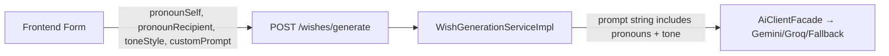

# Overhaul Wish Generation — User-Input Pronouns + Tone Selector (v2)

## 1. Summary

Thay vì tự suy đoán xưng hô từ `relationship`, thiết kế mới cho phép **user tự nhập xưng hô** (xưng: "anh", hô: "em") và **chọn tone từ list cố định**. Lý do:

- Xưng hô tiếng Việt cực kỳ đa dạng (tôi-ông, con-bà, tao-mày, em-chị...) → không thể classify hết bằng keyword matching.
- Tone do user chọn → tránh nhập linh tinh, và fallback lẫn AI đều dùng được.
- **`relationship` trên Recipient** vẫn giữ để hiển thị/quản lý danh bạ, nhưng **không dùng trong logic sinh lời chúc nữa**.

## 2. Design Overview

### Luồng mới trên UI:

```
┌─────────────────────────────────────────────┐
│  Cách xưng hô:                              │
│  ┌─────────────┐  ┌──────────────────┐      │
│  │ Xưng: [anh] │  │ Hô: [em]        │      │
│  └─────────────┘  └──────────────────┘      │
│                                              │
│  Giọng điệu:                                │
│  ┌──────────────────────────────────────┐   │
│  │ [▼] Ngọt ngào, tình cảm            │   │
│  └──────────────────────────────────────┘   │
│                                              │
│  Gợi ý thêm (tùy chọn):                    │
│  ┌──────────────────────────────────────┐   │
│  │ nhắc chuyện đi Đà Lạt...            │   │
│  └──────────────────────────────────────┘   │
└─────────────────────────────────────────────┘
```

### Tone options (enum `ToneStyle`):

| Value | Label VI | Label EN |
|---|---|---|
| `SWEET` | Ngọt ngào, tình cảm | Sweet & Romantic |
| `PLAYFUL` | Vui tươi, hài hước | Playful & Funny |
| `WARM` | Ấm áp, chân thành | Warm & Sincere |
| `RESPECTFUL` | Kính trọng, trang nghiêm | Formal & Respectful |
| `CASUAL` | Thoải mái, bình dân | Casual & Chill |

### Data flow:



- `pronounSelf` + `pronounRecipient` + `toneStyle` được truyền qua `GenerateWishRequest` DTO.
- `WishGenerationServiceImpl` đưa thông tin này vào context string.
- **SmartFallbackAiClient** dùng trực tiếp để render template.
- **Gemini/Groq** nhận thông tin trong prompt → tự xử lý ngôn ngữ tự nhiên.

## 3. Proposed Changes

---

### Backend — Enum

#### [NEW] [`ToneStyle.java`](file:///d:/something-vibe/backend/src/main/java/com/timecapsule/wishes/enums/ToneStyle.java)
- Enum: `SWEET`, `PLAYFUL`, `WARM`, `RESPECTFUL`, `CASUAL`

---

### Backend — DTO

#### [MODIFY] [`GenerateWishRequest.java`](file:///d:/something-vibe/backend/src/main/java/com/timecapsule/wishes/dto/request/GenerateWishRequest.java)
- Add fields: `String pronounSelf`, `String pronounRecipient`, `ToneStyle toneStyle`
- `toneStyle` defaults to `WARM` if null (validation sẽ xử lý ở service)

---

### Backend — Service

#### [MODIFY] [`WishGenerationServiceImpl.java`](file:///d:/something-vibe/backend/src/main/java/com/timecapsule/wishes/service/impl/WishGenerationServiceImpl.java)
- Thêm pronoun/tone info vào context string truyền cho AI:
  ```
  Xưng hô: anh (người viết) - em (người nhận). Giọng điệu: ngọt ngào.
  ```

#### [MODIFY] [`SmartFallbackAiClient.java`](file:///d:/something-vibe/backend/src/main/java/com/timecapsule/wishes/service/impl/SmartFallbackAiClient.java)
- **Bỏ** `classifyRelationship()` — không cần nữa.
- Parse `pronounSelf`, `pronounRecipient`, `toneStyle` từ prompt string.
- Dùng pronoun trực tiếp trong template: `"{pronounRecipient} ơi,"`, `"{pronounSelf} chúc {pronounRecipient}..."`.
- Tone chọn template pool phù hợp (SWEET/PLAYFUL/WARM/RESPECTFUL/CASUAL) × language (VI/EN)
- Pronoun substitution trong tất cả template
- Bỏ paste nguyên văn customPrompt vào wish
- Files: `SmartFallbackAiClient.java`
- Depends: T1

---

### Frontend — Types & API

#### [MODIFY] [`types/index.ts`](file:///d:/something-vibe/frontend/src/types/index.ts)
- Add: `type ToneStyle = 'SWEET' | 'PLAYFUL' | 'WARM' | 'RESPECTFUL' | 'CASUAL'`

#### [MODIFY] [`GenerateWishPage.tsx`](file:///d:/something-vibe/frontend/src/features/wishes/GenerateWishPage.tsx)
- Add state: `pronounSelf`, `pronounRecipient`, `toneStyle`
- Add UI: 2 text inputs (xưng/hô) + 1 dropdown (tone)
- Send new fields in `POST /wishes/generate`
- Giữ `customPrompt` textarea nhưng đổi label → "Gợi ý thêm cho AI"

---

### Frontend — i18n

#### [MODIFY] [`vi.json`](file:///d:/something-vibe/frontend/src/i18n/locales/vi.json)
- Add keys: `wishes.pronounSelf`, `wishes.pronounRecipient`, `wishes.toneStyle`, `wishes.tones.*`

#### [MODIFY] [`en.json`](file:///d:/something-vibe/frontend/src/i18n/locales/en.json)
- Same keys in English

---

### Backend — Tests

#### [MODIFY] [`SmartFallbackAiClientTest.java`](file:///d:/something-vibe/backend/src/test/java/com/timecapsule/wishes/service/SmartFallbackAiClientTest.java)
- Update prompts to include pronoun/tone info
- Assert pronoun substitution
- Assert tone affects output style

---

## 4. Tasks

- [x] **T1 — Backend: ToneStyle enum + GenerateWishRequest DTO update**
- [x] **T2 — Backend: WishGenerationServiceImpl — truyền pronoun/tone vào context**
- [x] **T3 — Backend: Rewrite SmartFallbackAiClient hoàn toàn**
- [x] **T4 — Frontend: types + GenerateWishPage form + i18n**
- [x] **T5 — Backend: Unit tests**

## 5. Open Questions

> [!IMPORTANT]
> **Giữ hay bỏ field `relationship` trên Recipient entity/form?**
> Đề xuất: **Giữ nguyên** — nó vẫn có giá trị cho việc tổ chức/hiển thị danh bạ, chỉ không dùng trong logic sinh lời chúc nữa.

## 6. Verification Plan

### Automated Tests
```bash
mvn test -Dtest=SmartFallbackAiClientTest
```

### Manual Verification
- Deploy → test: xưng "anh", hô "em", tone "Ngọt ngào" → wish xưng anh/em
- Đổi xưng "tớ", hô "cậu", tone "Vui tươi" → style khác hoàn toàn
- English: pronoun bỏ trống → fallback "I/you"

## 7. Rollout Notes
- Không cần migration database
- Không cần biến môi trường mới
- Backend DTO thêm optional fields → backward compatible
